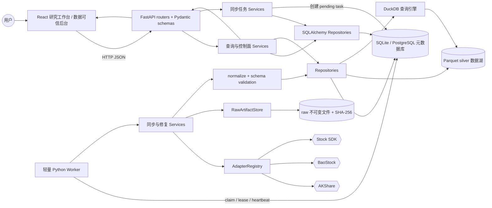
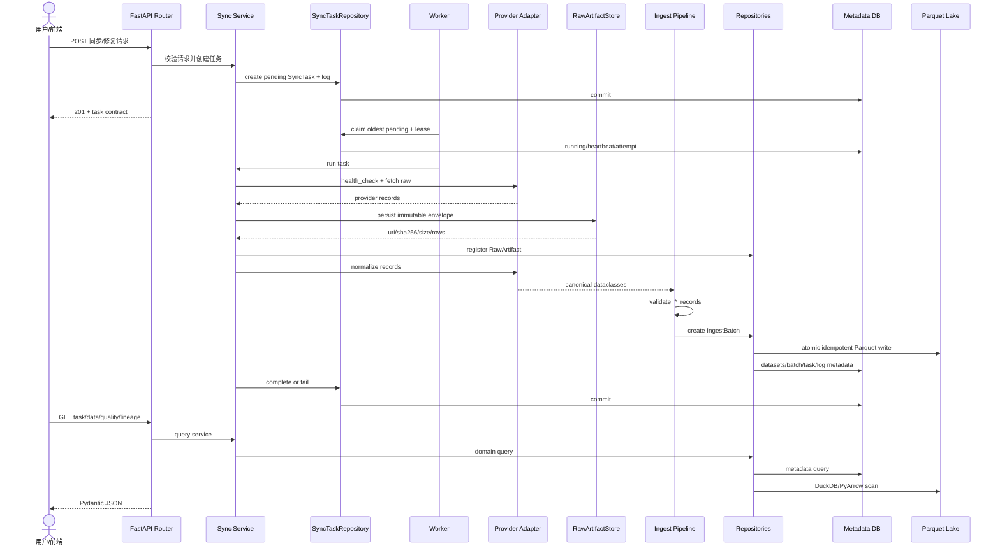
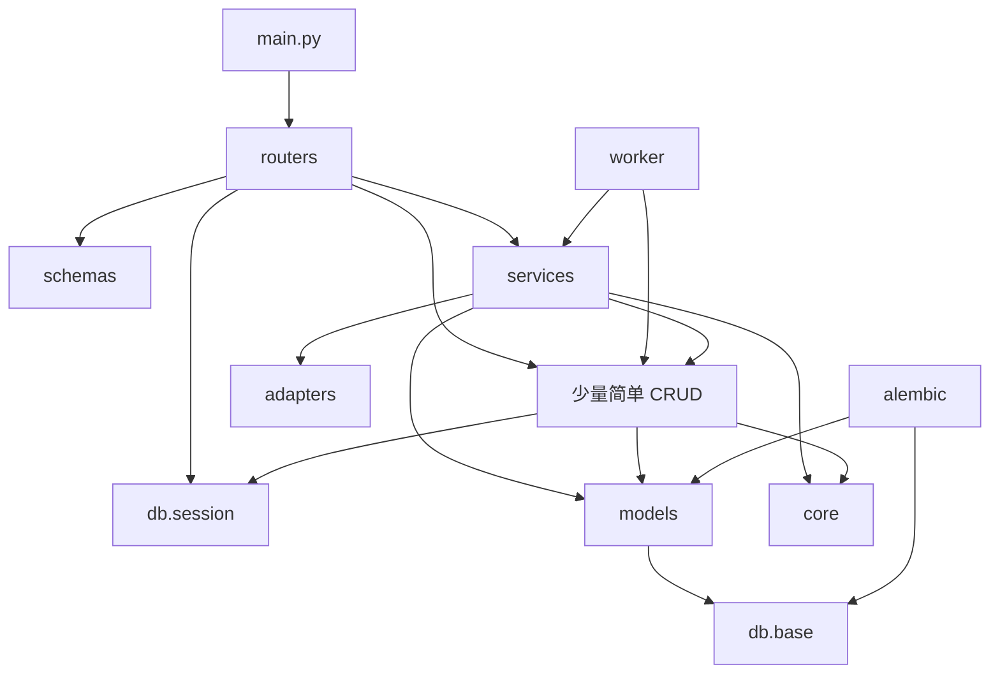

# Quant 完整架构说明

> 本文基于当前仓库代码整理；描述的是已实现架构，而不是未来规划。路径均相对于仓库根目录。历史设计若与本文及当前代码冲突，以当前代码和测试为准。

## 1. 项目概述

Quant 是一个 **local-first（本地优先）的 A 股量化研究工作台**。它把股票研究界面与数据可信控制面放在同一个模块化单体中：用户可维护自选股、查看行情/K 线/板块/新闻，同时可以检查数据源健康度、发起同步与修复、追踪入库批次、质量报告和数据血缘。

系统当前重点不是实盘交易或完整回测，而是建立可治理、可追溯、可复现的 A 股数据基础：

- 数据先由统一适配器接入，再经过标准化、硬校验、批次登记与质量检查；
- 元数据和控制面状态落在 SQLite（本地默认）或 PostgreSQL（主路径目标）；
- 大体量日线数据落在本地 Parquet 数据湖，DuckDB 负责扫描和查询；
- 原始响应以带 SHA-256 的不可变 raw artifact 留存，可离线 replay；
- 研究、因子、回测、策略与 AI 模块只能消费稳定 API 或受治理数据集，不得绕过治理链路直连 provider、底层表或物理 Parquet 路径。

### 1.1 技术栈

| 层 | 技术 |
| --- | --- |
| Web | React 18、TypeScript、Vite、Ant Design/ProComponents、TanStack Router/Query、lightweight-charts |
| API | Python 3.11+、FastAPI、Pydantic v2、SQLAlchemy 2 |
| 元数据 | SQLite fallback / PostgreSQL，可由 `DATABASE_URL` 切换 |
| 数据湖 | PyArrow + 分区 Parquet，默认 `storage/lake` |
| 查询引擎 | DuckDB（扫描 Parquet；失败时部分查询回退 PyArrow） |
| 数据源 | AKShare、BaoStock、Stock SDK；`source=auto` 支持按能力、健康和历史成功率择源 |
| 任务执行 | 轻量 Python worker + 数据库任务租约/心跳，不引入 Celery/Redis |
| 迁移与测试 | Alembic、pytest、ruff；测试覆盖 API、worker、脚本和前端契约 |

### 1.2 产品边界

- **研究工作台**：总控台、股票池、股票详情、行情/K 线、新闻、板块、自选股、研究数据读取。
- **数据可信控制面**：数据源、同步任务/调度、数据库状态、覆盖率、质量、血缘、缺口修复。
- **当前非目标**：实盘下单、完整回测引擎、移动端、插件市场、分布式调度平台。

## 2. 整体架构

Quant 是一个前后端分离开发、可由 FastAPI 托管前端构建产物的模块化单体。写链路与读链路共享领域模型和仓库，但外部 provider 只允许从适配器/服务层进入。



### 2.1 运行入口

| 入口 | 作用 |
| --- | --- |
| `backend/app/main.py` | 创建 FastAPI、初始化数据库、注册 12 个 router、配置 CORS，并在存在 `frontend/dist` 时托管 SPA。 |
| `scripts/run_api_server.py` | 面向本地开发的 API 启动/探测命令包装。 |
| `backend/worker/sync_stocks.py` | 创建、领取和执行股票列表、日线、市场修复、交易日历与 raw replay 任务。 |
| `frontend/src/main.tsx` | 挂载 React 应用；路由、主题和 Query Provider 位于 `frontend/src/app/`。 |

## 3. 目录结构与后端分层

```text
Quant/
├── backend/
│   ├── app/
│   │   ├── adapters/       外部数据源防腐层：能力声明、抓取、标准化、健康检查
│   │   ├── alembic/        元数据库 schema 迁移
│   │   ├── core/           环境配置与 A 股证券代码规则
│   │   ├── db/             SQLAlchemy 会话、缓存、DuckDB 连接与基础 ORM
│   │   ├── models/         19 张元数据/业务表的 SQLAlchemy ORM
│   │   ├── repositories/   持久化边界：元数据 CRUD、Parquet 日线读写
│   │   ├── routers/        FastAPI HTTP 边界（当前代码 12 个 router、52 个显式端点）
│   │   ├── schemas/        Pydantic 请求/响应契约
│   │   ├── services/       同步、查询、质量、血缘、版本和研究读取等领域编排
│   │   └── main.py         应用工厂与路由/静态资源装配
│   └── worker/             数据库任务队列的轻量执行器与 CLI
├── frontend/               React + Vite + Ant Design 研究台和控制面
├── scripts/                启动、运维、新闻与板块同步脚本
├── tests/                  API、worker、脚本和前端静态契约测试
├── docs/                   产品、架构、数据、ADR、运行手册与状态文档
└── storage/                SQLite、DuckDB、raw artifact、Parquet lake 等本地状态
```

### 3.1 `backend/app` 分层职责

| 层 | 允许做什么 | 不应做什么 |
| --- | --- | --- |
| `routers` | 参数接收、依赖注入、HTTP 状态码和异常转换、调用 service/repository | 直接抓取 provider、承载复杂同步流程 |
| `schemas` | 定义稳定 JSON 输入输出、字段约束和 ORM 序列化 | 数据库操作、网络请求 |
| `services` | 业务规则、任务状态机、适配器选择、摄取/修复/质量/版本编排 | 暴露数据库会话给前端 |
| `repositories` | 隔离 SQLAlchemy、Parquet/DuckDB 细节，提供领域化读写方法 | 决定 HTTP 行为或 provider 选择策略 |
| `models` | ORM 表、约束、索引和关系 | 网络与页面逻辑 |
| `adapters` | 封装第三方 API 差异并产出 canonical dataclass | 将 provider 原始结构泄漏到 service/API |
| `db` | 引擎、会话、迁移启动、连接和缓存基础设施 | 领域决策 |
| `core` | 全局无状态配置与市场规则 | 业务工作流 |

### 3.2 ORM 数据模型（19 张表）

| 表/模型 | 语义 |
| --- | --- |
| `stocks` / `Stock` | A 股证券主数据、上市状态、行业和数据新鲜度。 |
| `data_sources` / `DataSource` | provider 注册信息、启用/优先级、健康状态和运行统计。 |
| `stock_boards` / `StockBoard` | 行业/概念板块及行情汇总。 |
| `stock_board_members` / `StockBoardMember` | 板块与股票成员关系。 |
| `sync_tasks` / `SyncTask` | 异步同步任务、进度、失败信息、租约、心跳与重试 attempt。 |
| `sync_task_logs` / `SyncTaskLog` | 任务事件日志及结构化 payload。 |
| `sync_schedules` / `SyncSchedule` | cron 式同步计划与最近触发状态。 |
| `raw_artifacts` / `RawArtifact` | 原始响应文件 URI、校验和、范围、来源与复权口径。 |
| `ingest_batches` / `IngestBatch` | 每次摄取的 raw/normalized/dropped/written 计数、校验和质量状态。 |
| `datasets` / `Dataset` | 数据集目录、逻辑层、schema、分区、行数、新鲜度和质量。 |
| `dataset_versions` / `DatasetVersion` | 数据集候选/发布版本、manifest、schema hash 和质量信息。 |
| `dataset_version_partitions` / `DatasetVersionPartition` | 版本内不可变 Parquet 分区及校验和。 |
| `snapshots` / `Snapshot` | 跨数据集版本的命名快照；约束同一时刻至多一个 active。 |
| `snapshot_members` / `SnapshotMember` | snapshot 中按角色绑定的数据集版本。 |
| `trading_calendars` / `TradingCalendar` | 市场交易日及开闭市标记。 |
| `data_quality_reports` / `DataQualityReport` | 数据质量检查指标、严重度和历史结果。 |
| `watchlists` / `Watchlist` | 本地自选股分组。 |
| `watchlist_items` / `WatchlistItem` | 自选股成员、备注与排序。 |
| `news_articles` / `NewsArticle` | 新闻、股票关联及可选 embedding（PG 用 pgvector，SQLite 用 JSON）。 |

> 日线 OHLCV 不建为 SQLAlchemy 表：它由 `DailyBarRepository` 以 `(symbol, exchange, market, trade_date, adjust_type)` 为幂等键写入分区 Parquet。

## 4. 每个 Python 文件的功能说明

以下覆盖仓库当前全部 139 个 `.py` 源文件（含空的包标识文件和测试），每个文件一行概括。

### 4.1 应用入口、Core 与 DB

| 文件 | 功能 |
| --- | --- |
| `backend/app/__init__.py` | 标识后端应用 Python 包。 |
| `backend/app/main.py` | 构建 FastAPI 应用、初始化数据库、注册路由/CORS 并托管前端 SPA。 |
| `backend/app/core/__init__.py` | 标识核心配置包。 |
| `backend/app/core/config.py` | 从环境变量生成缓存的 Settings，并创建 SQLite 父目录。 |
| `backend/app/core/market_symbols.py` | 判定 A 股普通股票代码并生成 SQLAlchemy 上市普通股过滤条件。 |
| `backend/app/db/__init__.py` | 汇总数据库包的公共导出。 |
| `backend/app/db/base.py` | 定义 SQLAlchemy 2 声明式 ORM 基类。 |
| `backend/app/db/cache.py` | 延迟接入脚本数据加载缓存并提供按域失效入口。 |
| `backend/app/db/session.py` | 配置 SQLAlchemy engine/session、SQLite pragma、PG 扩展、Alembic 升级和 FastAPI DB 依赖。 |

### 4.2 数据源适配器

| 文件 | 功能 |
| --- | --- |
| `backend/app/adapters/__init__.py` | 导出 canonical 数据对象、适配器基类和默认 registry。 |
| `backend/app/adapters/base.py` | 定义能力/元数据/健康结果、标准化股票/日线/日历 dataclass 和抽象适配器协议。 |
| `backend/app/adapters/registry.py` | 注册、查找和按优先级列举 AKShare、BaoStock、Stock SDK 适配器。 |
| `backend/app/adapters/akshare.py` | 封装 AKShare 股票列表与日线抓取、重试、字段映射和标准化。 |
| `backend/app/adapters/baostock.py` | 封装 BaoStock 登录、股票/日线/日历抓取及复权字段标准化。 |
| `backend/app/adapters/stock_sdk.py` | 通过 Stock SDK 获取股票和日线并兼容多种 payload/代码格式。 |
| `backend/app/adapters/_http.py` | 为 Stock SDK 提供 HTTP/Node 桥接、JSON 调用和运行目录定位基础设施。 |

### 4.3 Alembic 迁移

| 文件 | 功能 |
| --- | --- |
| `backend/app/alembic/env.py` | 配置离线/在线 Alembic 迁移并绑定 ORM metadata。 |
| `backend/app/alembic/versions/7fce16dfa838_initial_schema.py` | 创建初始元数据 schema，并兼容已有表。 |
| `backend/app/alembic/versions/9c1f4e6b7a2d_add_raw_artifacts.py` | 增加 raw artifact 表及 ingest batch 关联。 |
| `backend/app/alembic/versions/0c6e4a2d91f7_add_sync_task_leases_and_partial_failures.py` | 增加任务租约/心跳/attempt 与部分失败字段。 |
| `backend/app/alembic/versions/a6b4d8e2f130_add_dataset_versions.py` | 增加 dataset version 与 partition 表。 |
| `backend/app/alembic/versions/b7c9e1f4a260_add_snapshots.py` | 增加 snapshot、成员关系及唯一 active 约束。 |
| `backend/app/alembic/versions/b9e6c3d42f18_add_ingest_dropped_records.py` | 增加入库批次 dropped_records 计数。 |
| `backend/app/alembic/versions/c7e1a8d4b930_add_raw_adjust_type.py` | 为 raw artifact 增加复权口径。 |
| `backend/app/alembic/versions/a4d2f7e91c30_add_replay_input_artifact.py` | 为 replay 任务增加输入 raw artifact 外键。 |
| `backend/app/alembic/versions/d2f4b8c1e907_align_raw_artifact_foreign_keys.py` | 统一 raw artifact 相关外键的 RESTRICT 语义并兼容 SQLite 重建。 |
| `backend/app/alembic/versions/e8a4b2c7d915_add_dataset_version_bundle_key.py` | 为数据集版本增加 bundle_key。 |
| `backend/app/alembic/versions/f3a9c5d7e812_add_active_raw_replay_unique_index.py` | 清理重复活动 replay，并建立按 artifact/复权口径的局部唯一索引。 |

### 4.4 Models 与 Repositories

| 文件 | 功能 |
| --- | --- |
| `backend/app/models/__init__.py` | 集中导出 19 个 ORM 实体。 |
| `backend/app/models/entities.py` | 定义全部 ORM 表、关系、约束、索引、UTC 时间和 pgvector/JSON 兼容列。 |
| `backend/app/repositories/_base.py` | SQLAlchemy Repository 基类，提供 `self.db` 公共入口。 |
| `backend/app/repositories/_query.py` | 公用 `paginated_query()` 分页查询 helper。 |
| `backend/app/repositories/stocks.py` | 查询、分页、upsert 股票主数据并更新数据新鲜度。 |
| `backend/app/repositories/daily_bars.py` | 以文件锁和原子替换幂等写入分区 Parquet，并通过 DuckDB/PyArrow 查询日线。 |
| `backend/app/repositories/trading_calendars.py` | upsert、分页和查询市场交易日历。 |
| `backend/app/repositories/data_sources.py` | 同步 registry 到数据库、保留退役来源并管理启用/健康/优先级。 |
| `backend/app/repositories/datasets.py` | 建立和更新股票、日线、日历等数据集目录记录。 |
| `backend/app/repositories/dataset_versions.py` | 从 manifest 创建、查询和发布数据集版本/分区。 |
| `backend/app/repositories/snapshots.py` | 创建、激活、退役快照并维护数据集版本成员。 |
| `backend/app/repositories/raw_artifacts.py` | 将 raw 文件元数据登记为可追溯 RawArtifact。 |
| `backend/app/repositories/ingest_batches.py` | 管理摄取批次创建、成功、失败和 reconcile_required 状态。 |
| `backend/app/repositories/sync_tasks.py` | 管理任务/日志、数据库租约、心跳、领取、恢复陈旧任务和 replay 幂等。 |
| `backend/app/repositories/sync_schedules.py` | 初始化、读取、更新和触发同步计划。 |
| `backend/app/repositories/stock_boards.py` | upsert 板块及成员并提供板块股票查询。 |
| `backend/app/repositories/news_articles.py` | 新闻去重写入、分页搜索、股票关联和过期清理。 |
| `backend/app/repositories/watchlist.py` | 创建默认自选组并增删、列举、重排股票。 |

### 4.5 Schemas

| 文件 | 功能 |
| --- | --- |
| `backend/app/schemas/__init__.py` | 标识 API schema 包。 |
| `backend/app/schemas/stocks.py` | 定义股票分页、详情、覆盖率、质量、批次和同步请求契约。 |
| `backend/app/schemas/market_data.py` | 定义日线查询、同步与市场修复预览/执行契约。 |
| `backend/app/schemas/trading_calendars.py` | 定义交易日历分页和同步请求契约。 |
| `backend/app/schemas/data_sources.py` | 定义 provider 列表、目录、更新、健康与 smoke-test 契约。 |
| `backend/app/schemas/sync_tasks.py` | 定义任务/日志/批次/调度/runner 状态及来源选择兼容校验。 |
| `backend/app/schemas/datasets.py` | 定义数据集详情和分页契约。 |
| `backend/app/schemas/data_quality.py` | 定义质量总览、报告、运行历史和检查结果契约。 |
| `backend/app/schemas/database.py` | 定义存储状态、数据集快照、覆盖、水位、provider 集成和血缘契约。 |
| `backend/app/schemas/research_data.py` | 定义 governed BarReader 的 bars、manifest、batch 和 contract 契约。 |
| `backend/app/schemas/watchlist.py` | 定义自选股组、条目读取和新增请求契约。 |

### 4.6 Routers

| 文件 | 功能 |
| --- | --- |
| `backend/app/routers/__init__.py` | 标识路由包并供应用工厂导入。 |
| `backend/app/routers/health.py` | 提供服务健康检查。 |
| `backend/app/routers/market.py` | 提供展示型实时行情、指数、K 线、新闻、搜索和板块接口。 |
| `backend/app/routers/stocks.py` | 提供股票列表/详情/日线覆盖与质量/批次查询及股票同步。 |
| `backend/app/routers/market_data.py` | 提供日线分页、单股同步和市场缺口修复预览/执行。 |
| `backend/app/routers/trading_calendars.py` | 提供交易日历分页与同步。 |
| `backend/app/routers/data_sources.py` | 提供数据源目录、配置、健康检查和真实取样。 |
| `backend/app/routers/sync_tasks.py` | 提供任务、日志、批次、调度配置、手动触发和 runner 状态。 |
| `backend/app/routers/datasets.py` | 提供数据集目录分页与按名称查询。 |
| `backend/app/routers/data_quality.py` | 提供质量总览、报告、检查运行历史和手动检查。 |
| `backend/app/routers/database.py` | 提供数据库/数据湖状态、集成覆盖总览和批次血缘。 |
| `backend/app/routers/research_data.py` | 提供面向研究者的受治理单股 BarReader 接口。 |
| `backend/app/routers/watchlist.py` | 提供默认自选股的读取、添加、删除和排序。 |

### 4.7 Services

| 文件 | 功能 |
| --- | --- |
| `backend/app/services/_http.py` | 共享 HTTP 请求工具（_request 函数 + 2 秒请求缓存）。 |
| `backend/app/services/_utils.py` | 共享清洗/交易所代码/报价辅助函数。 |
| `backend/app/services/_provider.py` | `ProviderSelector` — adapter 筛选、健康检查、历史成功率排序和使用统计。 |
| `backend/app/services/_task_runner.py` | `SyncTaskRunner` — task 启动/成功/失败/日志/提交/刷新。 |
| `backend/app/services/data_source_service.py` | 编排 provider 注册、配置、健康检查与 capability smoke test。 |
| `backend/app/services/stock_sync_service.py` | 创建/执行股票列表同步，择源、保存 raw、校验、入库和更新数据集。 |
| `backend/app/services/sync_service.py` | 编排单股日线同步、自动 fallback、版本发布，并组合市场修复 mixin。 |
| `backend/app/services/daily_bar_ingest_pipeline.py` | 实现日线 fetch→raw→normalize→validate→batch→Parquet→dataset 主摄取流水线。 |
| `backend/app/services/pipeline.py` | 集中定义日线/市场修复常量并兼容导出摄取流水线。 |
| `backend/app/services/repair_service.py` | 为 MarketDataSyncService 提供市场级并行缺口修复执行逻辑。 |
| `backend/app/services/market_repair_planner.py` | 基于股票池、交易日历和已有日线生成逐股票修复计划。 |
| `backend/app/services/trading_calendar_service.py` | 创建/执行日历同步并留存 raw、校验、批次和数据集元数据。 |
| `backend/app/services/raw_artifact_store.py` | 将 provider 原始 envelope 原子落盘并计算 SHA-256、大小和行数。 |
| `backend/app/services/raw_replay_service.py` | 校验 raw 文件与 metadata 后离线重跑日线标准化/入库，不访问 provider。 |
| `backend/app/services/normalized_data_validation.py` | 对 canonical 股票、日线和日历执行字段、范围、重复键等硬校验。 |
| `backend/app/services/dataset_manifest.py` | 规范化、校验、哈希并原子持久化 dataset manifest。 |
| `backend/app/services/dataset_version_publisher.py` | 从 canonical 日线生成不可变版本分区/manifest 并登记发布状态。 |
| `backend/app/services/dataset_service.py` | 查询数据集目录、同步投影行数（含已合并的行数投影逻辑）。 |
| `backend/app/services/data_quality_service.py` | 检查重复、缺失交易日、OHLC 边界、负值和股票覆盖并记录报告。 |
| `backend/app/services/database_integration_service.py` | 聚合覆盖率、水位、数据集、provider、批次和 lineage 控制面视图。 |
| `backend/app/services/database_status_service.py` | 汇总元数据库、数据湖和 DuckDB 可用性/大小并脱敏连接串。 |
| `backend/app/services/research_data_service.py` | 通过当前 Parquet 或已发布 snapshot 读取受治理日线并返回 manifest 契约。 |
| `backend/app/services/stock_query_service.py` | 聚合股票分页、详情、覆盖、缺口、OHLC 质量及相关批次。 |
| `backend/app/services/sync_task_service.py` | 任务/日志/批次/runner 状态查询 + cron 调度管理（已合并计划服务）。 |
| `backend/app/services/quote_service.py` | 实时行情（腾讯API）、指数行情和股票搜索。 |
| `backend/app/services/kline_service.py` | K 线优先读取本地 governed 日线，必要时请求展示型外部行情。 |
| `backend/app/services/board_service.py` | 板块排行、板块成分股、股票所属行业查询（公共 API）。 |
| `backend/app/services/ths_sector_fetcher.py` | 同花顺行业板块数据抓取、HTML 解析、缓存、排行和同步。 |
| `backend/app/services/news_ingest_service.py` | 从新浪/财联社拉取、分类、关联股票、去重持久化并清理旧新闻。 |

### 4.8 Worker 与脚本

| 文件 | 功能 |
| --- | --- |
| `backend/worker/__init__.py` | 标识 worker 包。 |
| `backend/worker/sync_stocks.py` | 提供五类任务 enqueue/run/claim 调度、租约恢复和命令行入口。 |
| `scripts/__init__.py` | 标识运维脚本包。 |
| `scripts/run_api_server.py` | 解析本地 API 生命周期命令、启动 uvicorn 并执行服务探测。 |
| `scripts/data_loader.py` | 为展示型股票、搜索和日历数据提供本地加载与缓存兼容层。 |
| `scripts/ops/run_news_ingest.py` | 从命令行执行新闻摄取和旧新闻清理。 |
| `scripts/ops/sync_ths_members.py` | 从命令行同步同花顺行业板块及成分股。 |

### 4.9 测试文件

| 文件 | 功能 |
| --- | --- |
| `tests/api/conftest.py` | 创建隔离数据库、数据湖和 FastAPI TestClient 等 API 测试夹具。 |
| `tests/api/test_adapters.py` | 验证适配器能力、标准化、代码映射和 registry 行为。 |
| `tests/api/test_app_routes.py` | 验证应用路由装配和前端 SPA fallback。 |
| `tests/api/test_daily_bars_repository.py` | 验证 Parquet 日线幂等写入、分区、查询和并发保护。 |
| `tests/api/test_data_quality.py` | 验证质量检查指标、报告和 API。 |
| `tests/api/test_data_sources.py` | 验证数据源目录、配置、健康、smoke test 与退役语义。 |
| `tests/api/test_database_integration.py` | 验证覆盖、水位、provider、批次和 lineage 聚合。 |
| `tests/api/test_database_status.py` | 验证数据库/数据湖/DuckDB 状态与敏感信息脱敏。 |
| `tests/api/test_dataset_manifest.py` | 验证 manifest canonicalization、校验、哈希和原子存储。 |
| `tests/api/test_dataset_version_publisher.py` | 验证日线版本物化、manifest、分区和重复发布语义。 |
| `tests/api/test_dataset_versions.py` | 验证数据集版本 repository 和状态机。 |
| `tests/api/test_datasets.py` | 验证数据集列表、详情和行数投影 API。 |
| `tests/api/test_health_and_stocks.py` | 验证健康检查、股票查询和股票同步主路径。 |
| `tests/api/test_ingest_batches.py` | 验证入库批次计数、状态与任务关联。 |
| `tests/api/test_market_data.py` | 验证日线读取、同步、自动 fallback 和市场修复。 |
| `tests/api/test_market_kline.py` | 验证 K 线优先使用本地 governed 数据及降级行为。 |
| `tests/api/test_raw_artifact_migrations.py` | 验证 raw artifact 相关迁移和外键约束。 |
| `tests/api/test_raw_artifact_store.py` | 验证 raw envelope 原子落盘、摘要和 metadata。 |
| `tests/api/test_raw_replay_idempotency.py` | 验证 replay checksum、复权口径、幂等和局部唯一约束。 |
| `tests/api/test_research_data.py` | 验证 BarReader、manifest、snapshot 与 governed-only 契约。 |
| `tests/api/test_snapshot_migration.py` | 验证 snapshot 迁移的 active 唯一约束。 |
| `tests/api/test_snapshots.py` | 验证快照创建、成员、激活和退役状态机。 |
| `tests/api/test_sync_schedules.py` | 验证调度初始化、cron 校验、更新和触发。 |
| `tests/api/test_sync_tasks.py` | 验证任务分页、日志、批次、租约、心跳和 runner 状态。 |
| `tests/api/test_trading_calendars.py` | 验证交易日历查询、同步和校验。 |
| `tests/api/test_watchlist.py` | 验证自选股增删查和排序 API。 |
| `tests/scripts/test_run_api_server.py` | 验证 API 启动脚本参数、探测与错误处理。 |
| `tests/web/test_app_theme_contract.py` | 静态检查前端应用主题与布局契约。 |
| `tests/web/test_data_sources_theme_contract.py` | 静态检查数据源页面主题和组件契约。 |
| `tests/web/test_database_theme_contract.py` | 静态检查数据库管理页主题和结构契约。 |
| `tests/web/test_pipeline_page_contract.py` | 静态检查数据管线页面路由和展示契约。 |
| `tests/web/test_stock_kline_contract.py` | 静态检查股票详情 K 线 API/组件契约。 |
| `tests/web/test_sync_tasks_layout_contract.py` | 静态检查同步任务控制台布局与组件契约。 |
| `tests/worker/conftest.py` | 提供隔离 worker 数据库/数据湖夹具。 |
| `tests/worker/test_sync_stocks_worker.py` | 验证 worker enqueue、领取、执行、dispatch 和 CLI 输出。 |

## 5. API 与前端边界

`main.py` 当前注册 12 个 router、52 个显式 HTTP 端点。主要前缀和职责如下：

| Router | 端点数 | 主要边界 |
| --- | ---: | --- |
| `health` | 1 | `/health` |
| `market` | 11 | 展示型 quote/index/kline/news/search/sector |
| `database` | 3 | status、integration-overview、lineage |
| `data_quality` | 4 | overview、reports、check-runs、check |
| `data_sources` | 5 | 列表、catalog、更新、health-check、smoke-test |
| `datasets` | 2 | 数据集分页与详情 |
| `market_data` | 4 | 日线分页、同步、修复预览与执行 |
| `research_data` | 1 | governed bars |
| `stocks` | 6 | 股票列表/详情/覆盖/质量/批次/同步 |
| `sync_tasks` | 8 | 任务、计划、runner、日志和批次 |
| `trading_calendars` | 2 | 日历分页与同步 |
| `watchlist` | 5 | 自选股读写和排序 |

前端按以下方式分层：

- `frontend/src/app/`：应用 Provider、主题和 TanStack Router；
- `frontend/src/layouts/`：导航和页面骨架；
- `frontend/src/pages/`：页面级数据编排；
- `frontend/src/features/`：按 stocks、market-data、datasets、sync-tasks、data-quality、data-sources、database 等领域封装 API 和类型；
- `frontend/src/shared/`：HTTP client、分页、状态标签、K 线图、格式化和动效。

所有服务端业务状态由 TanStack Query 管理；前端只消费 HTTP 契约，不直接打开数据库、DuckDB、Parquet 或 provider。

## 6. 数据流

### 6.1 正式写入链路：数据源 → 适配器 → 服务 → 仓库 → API → 前端



链路要点：

1. Router 创建任务，不在 HTTP 请求内执行长耗时全量拉取。
2. Worker 使用数据库租约、心跳和 attempt 防止并发重复执行，并可恢复陈旧 running 任务。
3. `source=auto` 在执行阶段按启用状态、能力、实时健康、历史成功率和静态优先级选择 provider；`requested_source` 与最终 `source` 分开记录。
4. 原始响应先落 raw artifact，再标准化；因此失败可追踪，成功数据可离线 replay。
5. 标准化对象通过硬校验后才写 canonical store；`raw_records - normalized_records` 显式计入 `dropped_records`。
6. `DailyBarRepository` 按市场/交易日分区，文件锁串行化跨线程/进程写入，临时文件 fsync 后 `os.replace` 原子替换，异常时回滚文件快照。
7. 写入后更新 Dataset、IngestBatch、股票新鲜度和缓存；任务日志保留 provider 尝试与错误。

### 6.2 正式读取链路

```text
React page
  → feature API module / shared HTTP client
  → FastAPI router + Pydantic query validation
  → query service（StockQuery / ResearchData / DatabaseIntegration / DataQuality）
  → metadata repository + DailyBarRepository
  → SQLAlchemy 查询 SQLite/PostgreSQL + DuckDB 扫描 Parquet
  → Pydantic response
  → TanStack Query cache
  → Ant Design 页面 / lightweight-charts
```

`/api/research-data/bars` 是当前最小 BarReader：调用者给出市场、股票、日期和复权口径，服务返回 bars 与数据集/批次/manifest 契约；调用者无需知道 provider、表名或文件路径。

### 6.3 Raw replay 链路

```text
已登记 RawArtifact
  → 创建 daily_bars_raw_replay（artifact + adjust_type 活动任务唯一）
  → Worker 校验文件存在、长度、SHA-256、envelope metadata
  → registry 定位原 provider adapter（不发网络请求）
  → normalize_daily_bars
  → 同一 validation / IngestBatch / DailyBarRepository 链路
```

replay 只重跑标准化与持久化，不把 `none/qfq/hfq` 之间的切换伪装为真实价格换算。

### 6.4 展示型实时数据旁路

`/api/market` 的实时 quote、指数、部分 K 线、板块和新闻属于展示边界，不等同于正式主数据管线。K 线优先读取 governed 日线后再降级；未来若要将实时行情/新闻作为研究数据持久化，必须补齐 canonical schema、raw、batch、quality 和 lineage，而不能延续前端直抓或无治理写入。

## 7. 模块间依赖关系

### 7.1 依赖方向



理想主方向为 `router → service → repository → model/storage`，外部输入为 `service → adapter → provider`。当前存在少量务实例外：简单 watchlist router 直接调用 repository；`raw_artifacts.py` 使用 `RawArtifactMetadata` 类型；`market_symbols.py` 为 SQL 过滤导入 `Stock`。这些没有形成 HTTP/provider 反向依赖，但维护时应避免继续扩大跨层耦合。

### 7.2 关键服务组合

| 上层服务 | 主要依赖 | 作用 |
| --- | --- | --- |
| `StockSyncService` | registry、DataSource/Stock/Task/Batch/Raw/Dataset repositories、validator | 股票主数据正式摄取。 |
| `MarketDataSyncService` | registry、DailyBarIngestPipeline、DatasetVersionPublisher、MarketRepairPlanner | 日线同步、自动 fallback、修复与版本发布。 |
| `DailyBarIngestPipeline` | adapter、RawArtifactStore、validator、DailyBar/Batch/Dataset/Stock repositories | 将单次日线抓取转换成可追溯 canonical 数据。 |
| `TradingCalendarService` | registry、Raw/Batch/Calendar/Dataset repositories、validator | 交易日历正式摄取。 |
| `RawDailyBarsReplayService` | registry、RawArtifactStore、MarketDataSyncService、TaskRepository | 离线重放原始日线。 |
| `DataQualityService` | ORM datasets/stocks/calendars/batches + DailyBarRepository | 运行跨数据域质量检查并记录报告。 |
| `DatabaseIntegrationService` | Dataset/Batch/Task/Calendar ORM + DailyBarRepository | 构造覆盖、水位、来源与血缘总览。 |
| `ResearchDataService` | Dataset/Batch/Snapshot ORM、DailyBarRepository、manifest validator | 为研究层屏蔽物理存储并附带治理契约。 |

### 7.3 存储依赖

- **元数据库**：ORM 实体、任务状态、来源、批次、数据集、版本、快照、质量、自选股、板块和新闻。
- **raw 文件区**：provider 原始 envelope；以元数据库 RawArtifact 为索引。
- **Parquet silver**：canonical 日线权威数据集，按 `market/trade_date` 分区。
- **DuckDB**：查询/扫描执行器，应可由 Parquet 重建，不作为独立不可解释的权威来源。
- **缓存**：覆盖率与展示型 loader 缓存；正式写入后显式失效。

## 8. 关键设计决策

### 8.1 Local-first，但保留数据库可替换性

默认 SQLite、Parquet 和 DuckDB 让个人用户无需外部基础设施即可运行；SQLAlchemy/Alembic 与 `DATABASE_URL` 保留切换 PostgreSQL 的能力。embedding 在 PostgreSQL 用 pgvector，在 SQLite 回退 JSON。

### 8.2 模块化单体而非微服务

API、worker、元数据和数据湖位于一个仓库、共享领域代码。个人研究工作台当前不引入 Kafka、Airflow、Celery、Redis、Iceberg/Delta 等运维成本；长任务通过数据库任务表和轻量 worker 解耦 HTTP 生命周期。

### 8.3 Provider 防腐层与 canonical contract

AKShare、BaoStock、Stock SDK 的代码、字段、复权和返回形态不同。适配器负责能力声明、健康检查、抓取和转换为 `NormalizedStock`、`NormalizedDailyBar`、`NormalizedTradingCalendar`；service/repository/API 不依赖 provider 原始结构。

### 8.4 `source=auto` 与真实来源分离

`auto` 是选择策略而不是数据来源。任务保留请求策略，IngestBatch/RawArtifact 记录最终 provider。运行时按能力、启用状态、健康检查、历史成功率及 priority 排序并 fallback，使失败仍可解释。

### 8.5 Raw-first、可追溯、可回放

正式 fetch 先保存不可变 raw envelope 和 SHA-256，再 normalize。这样可在 provider 离线时复现标准化问题、验证数据是否被篡改，并避免为修复解析器再次请求可能变化的外部数据。数据库局部唯一索引保证同一 artifact/复权口径只有一个活动 replay。

### 8.6 元数据与大表分离

控制面和关系数据适合 SQLite/PostgreSQL；日线大表适合列式 Parquet。DuckDB 直接扫描 Parquet，减少维护第二套大表数据库的负担。研究代码只通过 repository/BarReader 访问，避免物理路径成为公共 API。

### 8.7 幂等键、分区与原子文件写

日线身份固定为 `(symbol, exchange, market, trade_date, adjust_type)`，复权口径不可隐式混合。数据按市场/交易日分区，写入采用线程锁 + `flock`、去重合并、临时文件、fsync、原子替换和异常恢复，兼顾本地并发安全与可恢复性。

### 8.8 两级质量体系

`validate_*_records` 是写入前硬门槛；`DataQualityService` 是对已登记数据集的完整检查与历史报告。当前完整质量检查尚未成为每次 ingest 的 fail-closed 发布门禁；目标是 candidate → quality gate → published version → active snapshot。

### 8.9 交易日历是覆盖和缺口判断权威

系统不把自然日或主观“今天应该有数据”当成交易日。缺口修复和覆盖率以本地交易日历为准；未知交易日不会被凭空推断。

### 8.10 时间与复权语义显式化

`trade_date` 表示交易所本地日期，事件时间使用 UTC，A 股业务时区语义为 Asia/Shanghai。`none/qfq/hfq` 进入存储身份、任务、raw、batch、manifest 和读取契约；`adjust_factor=1.0` 不应被误解为已完整处理公司行动。

### 8.11 研究消费层不得复制摄取链路

因子、回测、策略和 AI 是数据基础的下游。它们必须通过 BarReader/DataPortal 或稳定 silver/gold 数据集消费；新增数据需求应进入统一 governed ingest，而不是在 notebook、前端或策略代码中直接调用第三方接口。

### 8.12 Dataset Version / Manifest / Snapshot 渐进落地

版本、分区、manifest、snapshot 模型和基础发布代码已经存在，用于不可变、可校验、可固定的研究输入；但质量门禁、管理 API/UI、全量初始化和 snapshot-bound DataPortal 仍是演进项，文档不把这些描述成已全面接入的主链能力。

## 9. 架构约束与扩展指南

新增正式数据域（例如公司行动、财务指标或治理后的新闻）应遵循：

1. 在 adapter base 增加 capability 与 canonical 类型；
2. 各 provider adapter 实现 fetch/normalize；
3. 增加写入前 validator；
4. 通过 service 创建 SyncTask，先保存 RawArtifact；
5. 通过 repository 写 canonical store，同时维护 IngestBatch/Dataset；
6. 增加质量检查、lineage 与版本/manifest 语义；
7. 用 Pydantic schema 和 router 暴露稳定 API；
8. 前端 feature 只调用 API，不感知 provider/表/文件路径；
9. 覆盖 adapter、repository、service、API、worker 和前端契约测试。

禁止新增的旁路包括：前端直接请求 provider、研究代码直读 SQL 表、业务代码拼接 Parquet 路径、脚本绕过任务/批次直接覆盖 silver 数据、在未声明复权口径时混合价格序列。

## 10. 当前演进重点

- 将完整数据质量检查接成版本发布门禁；
- 完成本地行情库初始化、每日增量与多复权口径一致性校验；
- 将 dataset version/manifest/snapshot 接入管理 API/UI 和主 BarReader；
- 扩展 DataPortal 的多股票批量读取、列投影和固定 snapshot；
- 增加 provider attempt、watermark、quarantine 与逐条标准化丢弃原因；
- 保持 Parquet 为可解释权威数据集、DuckDB 为可重建查询层。
