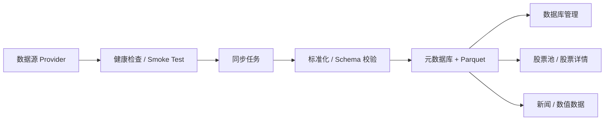

# 个人股票数据管理工作台产品定义

## 1. 产品定位

Quant 是一个本地优先的个人股票数据管理与研究工作台。它服务的不是通用数据平台，也不是一开始就追求完整量化交易系统，而是先把股票基础信息、日线行情、交易日历、数据源、同步任务、数据质量和数据库状态组织成一个稳定、可追溯、可持续扩展的系统。

用户每天真正需要打开的是研究入口：看股票、看新闻、看数值数据；数据库、同步、批次、质量和血缘是控制面，用来保证这些研究入口里的数据可信、可修、可追溯。

## 2. 设计目标

- 让用户快速看股票、看新闻、看数值数据。
- 让用户知道数据从哪里来、是否健康、是否真实写入。
- 让用户知道当前数据覆盖到哪一天、缺哪些、怎么补。
- 让后续研究、因子、回测模块直接消费统一数据，不再直连第三方数据源。

## 3. 产品分层

| 层级 | 角色 | 典型能力 |
| --- | --- | --- |
| 工作台层 | 用户每天看的东西 | 总控台、股票池、股票详情、新闻汇总、数值数据 |
| 控制面 | 数据可信后台 | 数据源管理、同步调度、数据库管理 |
| 接口面 | 稳定数据契约 | FastAPI、provider registry、normalize、schema_validate、ingest_batches、Parquet、DuckDB |

这三层要分开理解：

- 工作台层负责“看什么、怎么钻取”。
- 控制面负责“数据从哪里来、怎么修”。
- 接口面负责“把数据变成稳定契约”，不让上层直接依赖第三方接口或底层文件路径。

## 4. 核心闭环

这条闭环必须能回答八件事：

- provider 是谁
- metadata 是什么
- capabilities 支持什么
- health status 是否正常
- sample data 是否可解释
- schema 是否匹配
- row count 和 batch 是否清楚
- lineage 和 quality issue 是否可追溯

## 5. 页面主线

### 总控台

总控台只做结论，不做配置。它回答“今天能不能继续看股票和新闻”。

展示内容：

- 股票池数量
- 日线最新日期
- 数据源健康状态
- 最近同步任务
- 数据库容量
- 质量风险

### 股票池

股票池只做股票浏览和下钻。

展示内容：

- 股票列表
- 搜索和筛选
- 单股详情入口

### 股票详情

股票详情是研究主页面之一，聚合单只股票的关键上下文。

展示内容：

- 基础信息
- 日线预览
- 成交量和常用数值
- 最近同步批次
- 数据覆盖和质量状态
- 后续新闻区

### 新闻汇总

新闻汇总是研究入口，不是装饰页。它先承接新闻数据闭环，再逐步支持股票关联、来源过滤和时间过滤。

### 数值数据

数值数据承接常用行情字段、成交量、涨跌幅和后续指标，不提前扩成完整因子平台。

### 数据源管理

数据源管理只管 provider，不管研究展示。

展示内容：

- provider metadata
- capabilities
- health status
- sample data
- 启用 / 禁用
- 优先级
- 自动选择和 fallback

### 同步调度

同步调度只管任务和补数。

展示内容：

- 股票池同步
- 单股日线同步
- 交易日历同步
- 最近批次
- 失败原因
- 市场级缺口补齐

### 数据库管理

数据库管理只回答“数据是否可信、缺什么、怎么修”。

展示内容：

- schema
- row count
- batch
- lineage
- quality report
- quality issue
- sync status
- latest trade date
- coverage

阶段一当前验收范围：

- 可以查看、搜索和分页浏览 A 股股票池；
- 可以查看单股基础信息、日线、覆盖、质量和批次；
- 可以管理当前已注册的 AKShare、BaoStock、Stock SDK；
- 可以创建股票池、单股日线、交易日历和市场级补齐任务；
- 可以查看任务、日志、batch、真实来源、写入量、质量、血缘和覆盖缺口；
- 正式写入必须经过 normalize、schema 校验和 batch 留痕；
- 后续研究、因子、回测和策略不重新直连 provider。

## 6. 产品原则

- 先让数据可信，再让页面好看。
- 先收敛闭环，再扩展细节。
- 先做个人每天会用的路径，再做少数高级能力。
- 不把控制面和工作台混成一团。
- 不让页面变成通用运维台。
- 页面文案直接说明当前状态和下一步，不写空泛介绍。

## 7. 暂不做

- 不做完整交易系统
- 不做分布式任务平台
- 不做插件市场
- 不做大型数据湖架构重写
- 不做炫技式 UI
- 不把股票详情页扩成超大杂烩页

## 8. 验收标准

当这版成立时，用户应该能：

- 快速判断今天能不能继续看股票和新闻
- 明确知道数据源是否可用
- 明确知道行情是否补齐
- 明确知道质量问题出在哪个 batch
- 明确知道数据集最近更新到哪天
- 明确知道下一步该同步什么

## 9. 后续路线

- 第一阶段：股票数据管理闭环
- 第二阶段：新闻和数值数据增强
- 第三阶段：研究能力扩展
- 第四阶段：回测和策略接入

这份文档的核心意思只有一句话：

**Quant 不是“数据库后台”，而是“个人股票数据工作台”，数据库只是它的控制面。**
